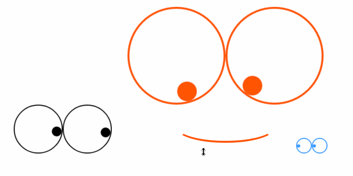

## CvsEyes

### 预览


[在线演示](http://seejs.me/eyes/demo/index.html)

### 使用

* ES6 Module
    ```bash
    npm install --save cvs-eyes
    ```
    在项目代码中：
    ```js
    import CvsEyes from 'cvs-eyes';
    ...
    <CvsEyes color="#f50" lineWidth={4} />
    ...
    ```

* Script
    ```xml
    <div id="root"></div>
    <script crossorigin src="https://unpkg.com/react@16/umd/react.production.min.js"></script>
    <script crossorigin src="https://unpkg.com/react-dom@16/umd/react-dom.production.min.js"></script>
    <script src="<pluginsHost>/dist/index.min.js"></script>
    <script>
    (function() {
        const Eyes = React.createElement(CvsEyes.default, {
            color: '#39f',
            lineWidth: 2
        });
        ReactDOM.render(Eyes, document.querySelector('#root');
    }();
    </script>
    ```

### 参数说明

* `color<String>`: 合法的颜色值，包括`rgba`、`rgb`或`hex`;
* `lineWidth<Number>`: 眼圈线宽度，建议整偶数。
